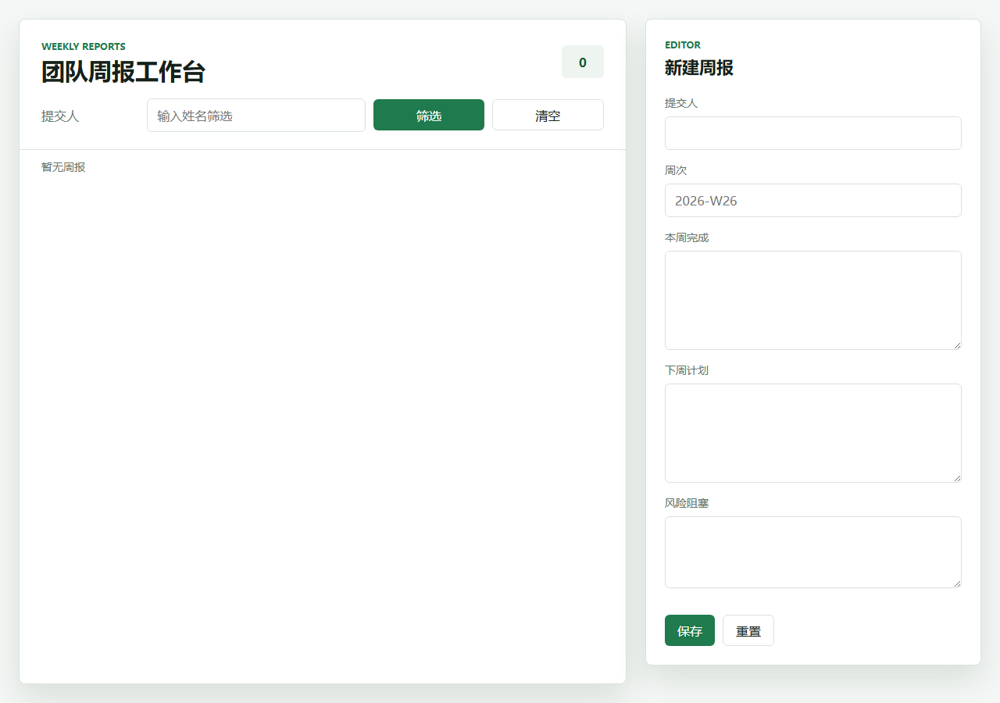

# 团队周报系统二版 - 6 项证据文档

## 0. 基本信息

- 本地仓库：`C:\Users\55345\Documents\zhoubao2`
- 当前分支：`codex/weekly-report-system-v2`
- Git 仓库链接：https://github.com/llw19981009/team-weekly-report-system
- 本地访问地址：`http://127.0.0.1:3102/`
- 实现性质：第二套透明参考/练习实现，不声明为他人独立完成
- 技术栈：Node.js 24、TypeScript、Express、原生 H5、`node:test`、Biome、内存仓储

## 1. 项目地图

项目地图使用 `AGENTS.md`，用于替代题目中的 `CLAUDE.md`。

- 文件：`AGENTS.md`
- 已包含：项目目标、技术栈声明、功能范围、API、H5 页面、目录说明、命令入口、风险预警
- 与第一版差异：本版使用 Express 路由，页面采用左右分栏工作台，字段命名和错误响应结构也重新设计

## 2. 计划文档

- 文件：`docs/superpowers/plans/2026-06-24-weekly-report-system-v2.md`
- 计划内容：工具链、领域模型、内存仓储、Express API、H5 页面、证据与沉淀
- 强制流程：先声明技术栈，再写计划，再测试优先实现，再小步提交，再验证和写证据
- 预警点：不能只做 H5；周次校验不能过宽；证据必须包含真实退出码；`SKILL.md` 必须可复用

## 3. 小步提交

以下历史截至证据文档提交前。

### `git log --oneline`

```text
e41586c docs: add h5 screenshot
51068dc fix: surface h5 delete failures
442b698 feat: add h5 weekly report workspace
1bf0fbc feat: add weekly report express api
d270b1d chore: align biome config and imports
5abc9af feat: add in-memory weekly report repository
9a77c06 feat: add weekly report domain rules
c70f25c chore: lock dependencies and ignores
dca8e24 chore: add express typescript toolchain
c518adb docs: add project map and v2 plan
```

### 每次提交触碰文件数

```text
c518adb docs: add project map and v2 plan | files=2
dca8e24 chore: add express typescript toolchain | files=3
c70f25c chore: lock dependencies and ignores | files=2
9a77c06 feat: add weekly report domain rules | files=2
5abc9af feat: add in-memory weekly report repository | files=2
d270b1d chore: align biome config and imports | files=2
1bf0fbc feat: add weekly report express api | files=3
442b698 feat: add h5 weekly report workspace | files=3
51068dc fix: surface h5 delete failures | files=1
e41586c docs: add h5 screenshot | files=1
```

结论：提交次数大于 5 次；每次提交触碰文件数均小于或等于 3。

## 4. 退出码证据

说明：本机 Node 与 pnpm 来自 Codex 捆绑运行时，因此验证命令前显式注入 PATH。

### 测试：`pnpm test`

```text
▶ weekly reports API
  ✔ creates, reads and lists reports (51.6539ms)
  ✔ filters reports by author (14.7207ms)
  ✔ updates and deletes reports (9.8115ms)
  ✔ returns validation errors and not-found responses (9.3413ms)
  ✔ rejects malformed report routes (7.217ms)
✔ weekly reports API (93.9517ms)
▶ weekly report model
  ✔ creates a report with generated metadata (0.3074ms)
  ✔ rejects blank author (0.0904ms)
  ✔ rejects week numbers outside ISO range (0.0849ms)
  ✔ rejects missing completed and plan content (0.0795ms)
  ✔ updates editable fields and refreshes updatedAt (0.2287ms)
✔ weekly report model (1.0869ms)
▶ InMemoryWeeklyReportRepository
  ✔ creates reports and lists newest first (0.1576ms)
  ✔ filters reports by trimmed author (0.0962ms)
  ✔ finds, updates and deletes a report (0.0759ms)
  ✔ returns undefined or false for missing reports (0.042ms)
✔ InMemoryWeeklyReportRepository (0.5066ms)
ℹ tests 14
ℹ suites 3
ℹ pass 14
ℹ fail 0
EXIT_CODE=0
```

### 类型检查：`pnpm typecheck`

```text
EXIT_CODE=0
$ tsc -p tsconfig.json --noEmit
```

### Lint：`pnpm lint`

```text
Checked 9 files in 16ms. No fixes applied.
EXIT_CODE=0
$ biome check .
```

### H5 smoke 与截图

```text
HOME_STATUS=200
HOME_HAS_TITLE=True
API_STATUS=200
API_BODY=[]
EXIT_CODE=0
SCREENSHOT=C:\Users\55345\Documents\zhoubao2\docs\screenshots\h5-home.png
BYTES=35505
```



## 5. Review findings

本版未伪装外部审查。受当前工具规则限制，未在用户未明确要求 subagent 的情况下启动独立 subagent；因此这里记录的是主流程代码复核结果。

### P0

- 未发现会导致系统无法启动、核心 API 不可用或测试整体失败的问题。

### P1

- 未发现会破坏题目强制流程、缺失核心交付物或导致周次校验明显错误的问题。

### P2

1. `public/main.js`：删除周报时直接调用 `fetch`，未检查非 2xx 响应。影响：删除失败时页面仍可能显示“已删除”。修复：`51068dc fix: surface h5 delete failures`，改为复用 `requestJson`，失败时进入统一错误提示。

复核后重新运行 `pnpm test` 与 `pnpm lint`，退出码均为 0。

## 6. 沉淀产物

沉淀产物为根目录 `SKILL.md`。它包含：

- 适用边界
- 技术栈选择建议
- 强制流程
- 交付物清单
- 常见翻车点预警

该文件面向同类“流程约束型 CRUD/H5 作业”的复用，不是本次开发流水账。
